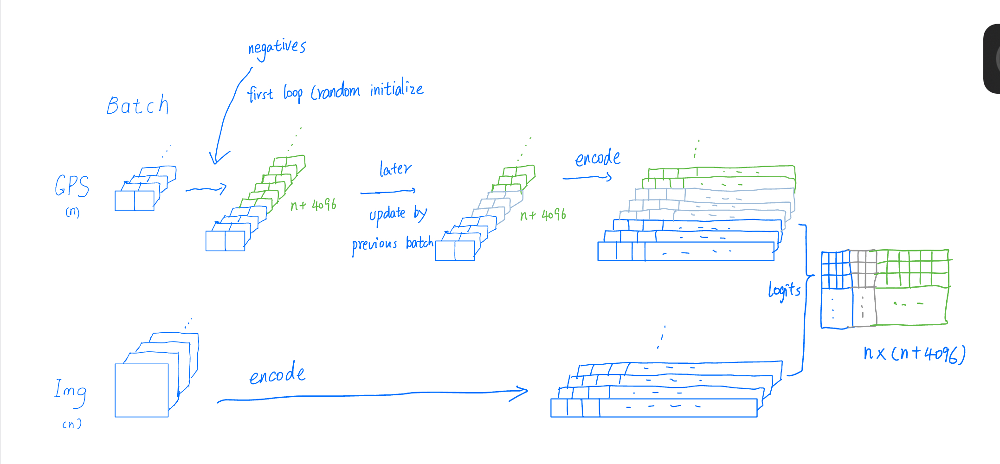
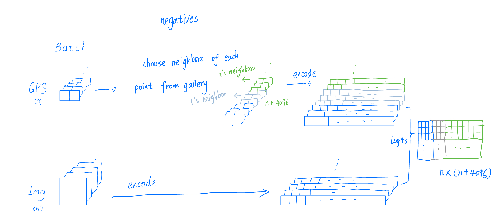

# Thesis_GeoLoc
**Boyi's Master Thesis -- Geolocalization**

This repository serves as a work log for Boyi's master thesis on geolocalization. 
---

## **Thesis Progress Overview**

| Date         | Task Category             | Description |
|-------------|--------------------------|-------------|
| **10.15 - 10.24** | Paper & Code Review | Reviewed papers on hard negative sampling and CLIP-inspired alignment. Explored **SampleGeo** and **GeoClip** repositories. |
| **11.5 - 11.19** | Dataset & Training | Downloaded **NUS Global Streetscapes** dataset (~25k images). Implemented noise in location embeddings. Training results show faster convergence with noise. |
| **12.01.2024** | Triplet Loss Experiment | Implemented triplet loss in **GeoClip**. Compared different negative sampling strategies. Hard negatives improved performance but still behind GeoClip. |
| **17.12.2024** | Contrastive Learning (InfoNCE) | Modified GeoClip’s negative sampling strategy. Performance on **im2gps3k** was worse than GeoClip. |
| **02.01.2025** | Training & Hyperparameters | Used 5% of **MP-16** dataset. Achieved comparable results to GeoClip. |
| **13.01.2025** | Spatial Analysis | Estimated semivariograms for MP-16, Streetscapes, and OSV5M datasets. |
| **15.01.2025** | Hard Negative Contrastive Loss | Implemented **Weighted** and **Weighted2** losses. **Weighted** outperformed GeoClip at **2500 km and 1 km** accuracy. |
| **16.01.2025** | Model Training & Testing | GeoClip outperformed Weighted on OSV5M, but Weighted was better on **IM2GPS3K (2500 km, 1 km accuracy)**. Training on MP16 improved results. |
| **28.01.2025** | Literature Review & Writing | Reviewed **10 papers**, drafted **related work and research gap**. |
| **Upcoming Tasks** | Next Steps | Modify logits using **semivariogram**, explore **DeClip loss combination**, optimize **negative selection strategy**, and learn **self-supervised methods**. |

---

## To-Do List

### 10.15 - 10.24

- [x] **Paper Review**: [*Hard Negative Sampling For Cross-View Geo-Localization*](https://arxiv.org/abs/2303.11851)
- [x] **Code Review**: Explored repository for **SampleGeo**
- [x] **Paper Review**: [*Clip-Inspired Alignment between Locations and Images for Effective Worldwide Geo-localization*](https://arxiv.org/pdf/2309.16020v2)
- [x] **Code Review**: Explored repository for **GeoClip**
- [x] **Dataset Handling**: Familiarized with the **MP-16 Dataset** used in GeoClip
- [x] **Script Reproduction**: Reproduced the training script for **GeoClip**
- [ ] **Training Task**: Train **SampleGeo** to assess performance
- [x] **Training Task**: Train **GeoClip** to assess performance

---

## Recent Work Update  11.5 - 11.19

### Dataset
- Downloaded partial [**NUS Global Streetscapes**](https://ual.sg/project/global-streetscapes/) dataset (~25,000 images).

### Training
- The official repo doesn't contain the full training code. implement it first.
- Successfully ran the training process.
- Noted that the original code did not include the step for adding noise to the location embeddings, as described in the paper. Implemented this step manually.

### Findings
- Trained the model for 20 epochs using a batch size of 64:
  - Adding noise to the embeddings resulted in a lower final loss compared to training without noise.
  - seems convergence was faster with noise addition.
- Evaluated performance based on the distance between predictions and labels at 1, 25, 200, 750, and 2500 km.
- Compared results between two models:
  - **Model 1**: Trained on our data.
  - **Model 2**: Pretrained model provided by the author, validated on the same dataset.
- **Observations**:
  - Our trained model performed worse at the 1 km threshold but achieved better accuracy at all other distances.

### Challenges
- Seems the loss function could be optimized.
- Observed that while loss decreases, performance improves across all distance thresholds—except for the 1 km threshold, where accuracy declines. 

---

### 12.01.2024

#### Dataset
- Continued using the Streetscapes dataset.

#### Experiment: Triplet Loss in GeoClip
- Modified GeoClip to use triplet loss as the loss function:
  - For each training data point, selected 5x batch size locations from the GPS gallery as neighbors.
  - Experimented with different strategies for selecting negative samples:
  - geoclip negative selection strategy 
  - proposed neighbor based selection strategy 
    1. Selected only the farthest locations as negatives.
    2. Combined the farthest locations with nearby hard negatives.
  - Used L2 norm as the distance function (default in triplet loss) and compared it with cosine similarity for consistency with GeoClip's inference approach.

#### Results
- Performance observations:
  - Overall performance with hard negatives outperformed using only farthest negatives but still fell short of GeoClip.
  - Accuracy at the 1 km threshold improved.
  - Using cosine distance for triplet loss led to faster convergence compared to L2 norm, but the final performance was worse.

---

### 17.12.2024

#### Experiment: Contrastive Loss (InfoNCE)
- GeoClip originally uses random negatives from previous batches.
- Modified approach to select 64 negatives for each data point:
  - Half selected as far negatives.
  - Half selected as hard nearby negatives.

#### Additional Work
- Familiarized with the **im2gps3k** and **yfcc16k** datasets.
- Tested model on **im2gps3k** dataset to benchmark against GeoClip.

#### Results
- Performance on the im2gps3k dataset was worse compared to GeoClip.

---

### 02.01.2025

#### Dataset
- Downloaded the **MP-16 Dataset** (4.7M images), used for GeoClip training.
- Used 5% of MP-16 for training.

#### Experiment
- Focused on hyperparameter tuning.

#### Results
- Achieved results comparable to GeoClip.

---

### 13.01.2025

#### Spatial Analysis
- Estimated semivariograms for MP-16, Streetscapes, and OSV5M datasets.

---

## **15.01.2025**  

### **Inspired by Paper [**Contrastive Learning with Hard Negative Samples (HCL)**](https://arxiv.org/pdf/2010.04592)**  
- Go through the paper and understand the idea
- Implemented two types of loss inspired by contrastive learning with hard negative samples:  
  - **Weighted**: Uses similarity (logits) times constant β (1.0) to reweight logits, making logits with high similarity larger.  
  - **Weighted2**: Follows the same implementation as the reference paper (with debiased τ and final loss calculation).  

### **Results**  
- **Models Tested**: Weighted, Weighted2, and GeoClip (all trained on OSV5M dataset, tested on IM2GPS3K dataset).  
  - **Weighted**: Outperformed GeoClip at 2500 km and 1 km accuracy.  
  - **Weighted2**: Underperformed compared to both Weighted and GeoClip.  

### **To-Do**  
- Create a test set from OSV5M to evaluate models within the same dataset.  
- Train **Weighted** on **MP16** to compare with GeoClip.  

### **Experiments**  
- Trained **Weighted** and **GeoClip** using OSV5M, tested on OSV5M test set and IM2GPS3K dataset.  
- Trained **Weighted** on **MP16**.  

### **Results**  
- **Training on OSV5M**:  
  - GeoClip performed significantly better than Weighted when tested on OSV5M test set.  
  - However, when tested on IM2GPS3K (2500 km and 1 km accuracy), Weighted outperformed GeoClip.  
- **Training Weighted on MP16**:  
  - Outperformed GeoClip at 2500 km accuracy.  

---
## **28.01.2025**  
- Literature review(10 papers)
- finished the draft of related work and research gap

---

### **To-Do**  
- Use **semivariogram** to modify logits (difference to estimated semivariogram model prediction).  
- Use **semivariogram** to adjust β in Weighted loss function.  
- Refer to **DeClip**: Combine different loss functions together.  
- Investigate **get_negatives** negative selection strategy (seems to favor 1 km accuracy). Combine **get_negatives** with **Weighted** model. 
- learn self-supervised

